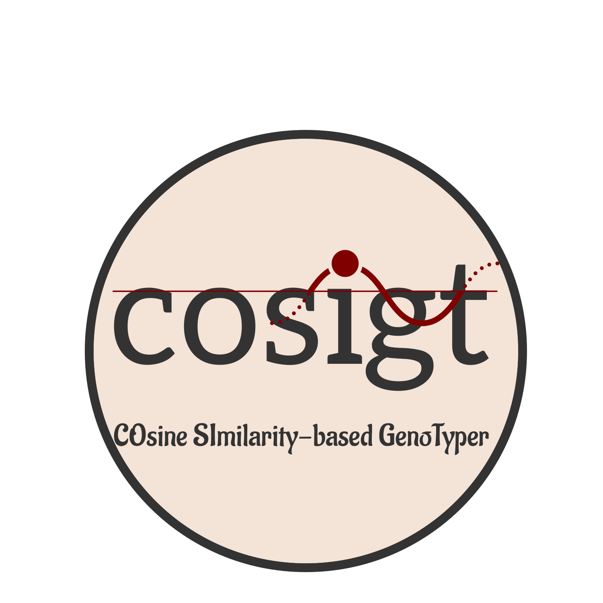

# Cosigt

Cosigt (COsine SImilarity-based GenoTyper) is a [snakemake pipeline](cosigt_smk/README.md) capable to assign structural haplotypes (that is, genotype) to sequenced samples using pangenome graphs. An initial explanation of the rationale behind cosigt is detailed in this manuscript [here](https://www.nature.com/articles/s41586-024-07911-1#Sec5).
See the [pipeline page](cosigt_smk/) for more information!

## License

This project is licensed under the MIT License - see the [LICENSE](LICENSE) file for details.

## Citation

If you use cosigt in your research, please cite:
XXX
