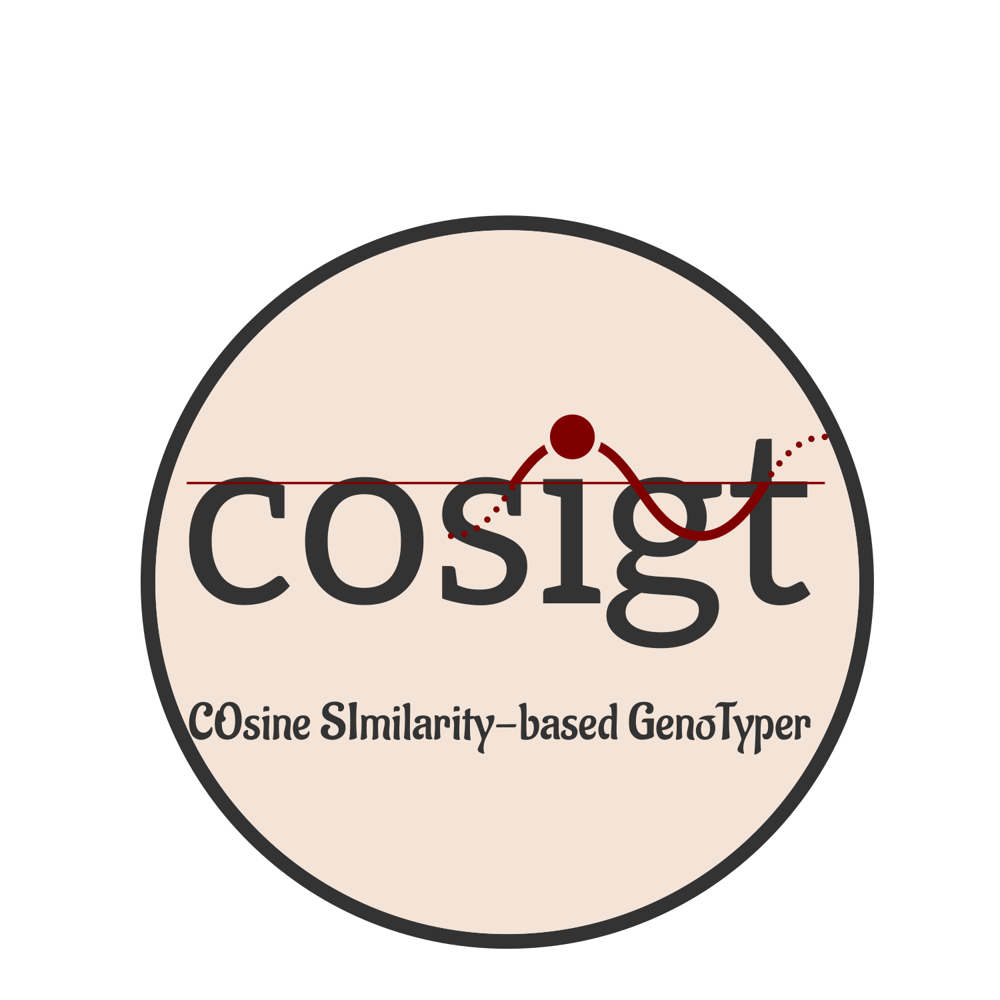

# Cosigt

## Background

Cosigt (COsine SImilarity-based GenoTyper) is a [snakemake pipeline](cosigt_smk/README.md) capable to assign structural haplotypes (that is, a genotype) to sequenced samples using pangenome graphs. An explanation of the rationale behind cosigt was first presented in this manuscript [[2]](#2). A detailed description of the pipeline and the algorithm is available in this preprint [[1]](#1).

## Pipeline

Extensive documentation describing how to set up and run cosigt is available in the online [documentation](https://davidebolo1993.github.io/cosigtdoc/). For the unified Snakemake workflow, start with `make init`, edit the generated files in `cosigt_smk/config/`, then run `make check`. Local, SLURM, LSF, and generic-cluster profiles live under `cosigt_smk/profiles/`.

The Go implementation of the genotyper lives in `cmd/cosigt/main.go`; the repository root is reserved for project-level files and pipeline entry points.

## License

This project is licensed under the MIT License - see the [LICENSE](LICENSE) file for details.

## Citation

If you use cosigt in your research, please cite the following references:

<a id="1">[1]</a> 
Bolognini, D. et al., (2026). 
Population-scalable genotyping from low-coverage sequencing data using pangenome graphs.
**bioRxiv** 2026.02.05.704023

<a id="2">[2]</a> 
Bolognini, D. et al., (2024). 
Recurrent evolution and selection shape structural diversity at the amylase locus.
**Nature** 634, 617–625
